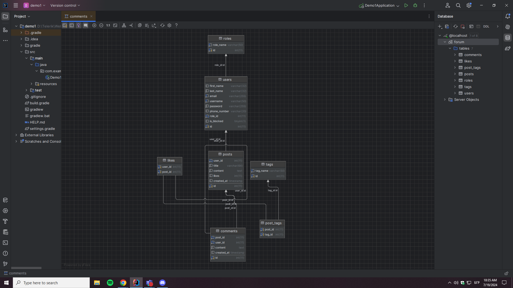

# Forum System APi

This project is a simple Blog API built with Spring Boot. It allows for managing users, posts, and comments.

## Table of Contents

- [Features](#features)
- [Technologies Used](#technologies-used)
- [Installation](#installation)
- [Usage](#usage)
- [API Endpoints](#api-endpoints)
    - [User Endpoints](#user-endpoints)
    - [Post Endpoints](#post-endpoints)
    - [Comment Endpoints](#comment-endpoints)
- [Contributing](#contributing)
- [License](#license)

## Features

- Create, read, update, and delete (CRUD) operations for users, posts, and comments.
- RESTful API design.

## Technologies Used

- Java
- Spring Boot
- Spring Web
- Loombok
- Spring Data JPA
- Spring Security
- MariaDB (MySQL) database

## Installation

1. Clone the repository:
    ```bash
    git clone https://github.com/forum-RAI/forum-aplication.git
    cd forum-aplication
    ```

2. Set up the database:
    - Update `application.properties` or `application.yml` with Amazon RDS settings:

#### Example `application.properties`
```properties
spring.datasource.url=jdbc:mariadb://forumsystem.cpy86y2sqlgo.eu-north-1.rds.amazonaws.com:3306/ForumSystem
spring.datasource.username=guest
spring.datasource.password=1234

# Other JPA/Hibernate settings if necessary
spring.jpa.hibernate.ddl-auto=update
spring.jpa.show-sql=true
spring.jpa.properties.hibernate.dialect=org.hibernate.dialect.MariaDBDialect
```


## Link to Swagger Documentation
[Swagger Documentation](http://localhost:8080/swagger-ui/index.html)

## Link to the Hosted Project
[Hosted Project](Not applicable yet) (if applicable)

## Database Relations


## Contributors
- [Alexander Slavchev](https://github.com/AlexanderSlavchev)
- [Ivan Puhniev](https://github.com/ivanpuhnievv)
- [Radoslav Stoychev](https://github.com/RAStoychev18)

## Usage

After running the application, you can use a tool like Postman or curl to interact with the API.

## API Endpoints

### User Endpoints

- **Get user with filter (name/email/lastname)**
    - `GET /users`
    - Request Body: name/email/lastname
    - Response: Filtered User object

- **Get user by ID**
    - `GET /users/{id}`
    - Path Variable: `id` (int)
    - Response: User object

- **Create a new user**
    - `POST /users`
    - Request Body: User object
    - Response: Created User object

- **Update a user**
    - `PUT /users/{id}`
    - Path Variable: `id` (int)
    - Request Body: User object
    - Response: Updated User object

- **Delete a user**
    - `DELETE /users/{id}`
    - Path Variable: `id` (int)
    - Response: No Content

### Post Endpoints

- **Get all posts**
    - `GET /posts`
    - Response: List of posts

- **Get post by ID**
    - `GET /posts/{id}`
    - Path Variable: `id` (int)
    - Response: Post object

- **Create a new post**
    - `POST /posts`
    - Request Body: Post object
    - Response: Created Post object

- **Update a post**
    - `PUT /posts/{id}`
    - Path Variable: `id` (int)
    - Request Body: Post object
    - Response: Updated Post object

- **Delete a post**
    - `DELETE /posts/{id}`
    - Path Variable: `id` (int)
    - Response: No Content

### Comment Endpoints

- **Get all comments**
    - `GET /comments`
    - Response: List of comments

- **Get comment by ID**
    - `GET /comments/{id}`
    - Path Variable: `id` (Long)

## Setup and Run Instructions

### Prerequisites
1. Install [JAVA JDK17](https://www.oracle.com/java/technologies/javase-jdk17-downloads.html)
2. Install [Gradle](https://gradle.org/install/)
3. Install [MariaDB](https://mariadb.org/download/)
4. Install [Spring Boot](https://spring.io/projects/spring-boot)
5. Install [Spring Data JPA](https://spring.io/projects/spring-data-jpa)
6. Install [Spring Security](https://spring.io/projects/spring-security)
7. Install [Lombok](https://projectlombok.org/setup/gradle)


